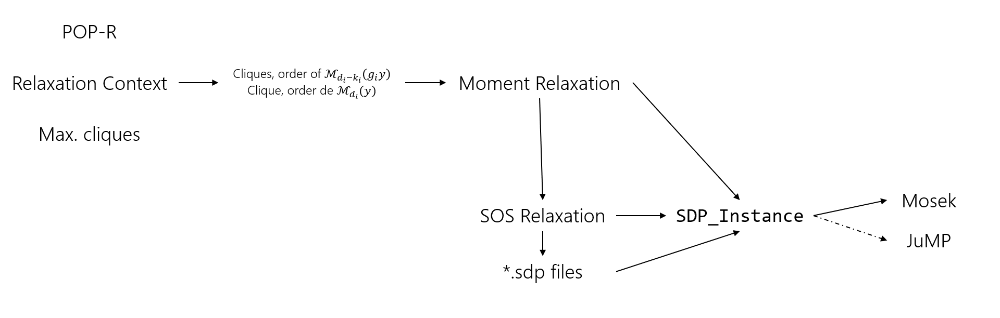

# Guide

This page aims to present the main features of the SDPhierarchy module, the simple high-level workflow and the lower-level workflow. Détails on how to set the hierarchy high-level call is available at this page ???, a mathematic description of each problem along with important implementation choices is available at this page ????.

## Purpose - general principle of relaxation

This module aims to implement a hierarchy of *Semi-Definite Positive* problems for Polynomials Optimisation Problems, modeled with the PolynomialOptim submodule of MathProgComplex. Given an input $POP$, one can choose to build a more or less tight SDP relaxation, leading to more or less large and tractable problems. This hierarchy was first laid out by J.B. Lasserre for real polynomial optimization problems. It was extended to complex polynomial optimization problems by C. Josz and D. Molzahn in order to leverage the structure available in complex polynomial problems, lost when converted to real polynomial problems by expliciting real and imaginary parts. Such complex polynomial optimization problems, $POP-\mathbb C$ arise when working on AC models of current transmission networks, for which current at each node of the network is modeled as a complex variable.

The SDP hierarchy applied to $POP-R$, the $POP-C$ converted to real variables, yields exact relaxations for orders of either 1 or 2 in general. However, problems with hundreds or more variables, the order 2 SDP relaxation cannot be solved by current state of the art SDP solvers. Hence the will to use the structure lying in complex problems, exploit symmetries, specify relaxation orders constraint-wise and not problem-wise and apply decomposition techniques.

### References

- 2001 Lasserre paper.
- Multi-ordered Lasserre hierarchy for large scale polynomial optimization in real and complex variables, *Josz, Cedric and Molzahn, Daniel K*, arXiv preprint arXiv:1709.04376, 2017
- Moment/sum-of-squares hierarchy for complex polynomial optimization, *Josz, Cédric and Molzahn, Daniel K*, arXiv preprint arXiv:1508.02068, 2015

## Features of the hierarchy

The following list details the main features of the implemented SDP hierarchy:

- *real or complex hierarchy*: given a $POP-C$, one can build a complex SDP relaxation, generaly more tractable than its real counterpart. Ideally, this problem would be solved by complex SDP solvers, however no such solvers mature enough exist as of yet. Therefore the complex SDP is converted to a real SDP and then solved, which is still generally preferable to switching to real numbers at the POP stage.
- *multiordered*: one $POP$ can lead to many more or less tights relaxations, depending on a global relaxation order. Actually, one can choose the relaxation orders at a constraint level. The resulting problem will equivalent in size to the problem with all constraint relaxed to the maximum relaxation order set for the multiordered version, unless a good decomposition is used at the same time.
- *dense or sparse*: given a $POP$ with a relaxation order $d$, the resultig SDP problem will have a matrix with as many rows and columns as exponents of global degree up to $d$ can be formed from the variables of the $POP$. Hence the exponentially increasing size of SDP relaxations with growing orders $d$. However one can build decomposed versions of this problem, based of the monomials of each constraint, which allow to split this large SDP matrix into smaller ones, along with coupling constraints. Finding the best decomposition given an input POP and constraint wise relaxation orders is a difficult problem.
- *symmetries*: it is known that if the input POP objective and constraints polynomials show a certain symmetry, all non-null moments of the SDP relaxations will feature this symmetry, which allows to set some coefficients of the SDP variables to 0. One symmetry arising on current transmission network is phase invariance: $\forall z\in \mathbb C, \theta\in [0, 2\pi[,\quad p(z) = p(e^{i \theta}z)$.
- *binary variables*: a variable $b\in\{0,1\}$ apperaing in an optimization problem can be treated as a continuous varibale $x^b$ with the added polynomial constraint $x^b (1-x^b)=0$, which fits the framework of the POP hierarchy.

## Hierarchy workflow

The hierarchy workflow is as follows.

Expected input is :

- the POP: $\min\left\{ f(x) : g_i(x) \ge 0,  i=1, ..., m\right\}$
- a `RelaxationContext` object containing all relaxation choices,
- a `max_cliques` object relevant to the decomposed version of the hierarchy. For the dense hierarchy, it can be built with `get_maxcliques(relax_ctx, problem)`.

Then several steps are taken:

- Parameters defining the constraints of the SDP problem are computed. Specifically, they give the orders $d_i$, $d_i - k_i$ and relevant variables for the moment matrix $\mathcal M_{d_i^{Cl_i}}(y_i)$ and localizing matrices $\mathcal M_{d_i-k_i}(g_i y_i)$



## simple "high level" workflow

```julia
## Build polynomial problem
x1 = Variable("x", Real)
x2 = Variable("y", Real)
problem = Problem()
set_objective!(problem, -1.0*x1)
add_constraint!(problem, "ineq", (x1^2+x2^2) << 4)
θ1 = π/3
add_constraint!(problem, "eq_rot1", (cos(θ1)*x1+sin(θ1)*x2) == 0)

## Set parameters
relax_ctx = set_relaxation(problem; hierarchykind=:Real,
                                    d = 1,
                                    params = Dict(:opt_outlev=>1,
                                                  :opt_pbsolved=>:SOSRelaxation,
                                                  :opt_solver=>:MosekCAPI))

## Build the order 1 SOS relaxation and pass it to Mosek via the C API.
primobj, dualobj = run_hierarchy(problem, relax_ctx);
```

Set important options, get objective values, get solution values, set order, symmetries, sparse

## simple example

Here is the low level equivalent of the previous code example.

```julia
using MathProgComplex

## Build polynomial problem
x1 = Variable("x", Real)
x2 = Variable("y", Real)
problem = Problem()
set_objective!(problem, -1.0*x1)
add_constraint!(problem, "ineq", (x1^2+x2^2) << 4)
add_constraint!(problem, "eq_rot1", (cos(π/3)*x1+sin(π/3)*x2) == 0)

relax_ctx = set_relaxation(problem; hierarchykind=:Real,
                                        d = 1,
                                        params = Dict(:opt_outlev=>1))


########################################
# Build sparsity pattern, chordal extension, maximal cliques.
# Simple dense problem : one clique with all variables.
max_cliques = get_maxcliques(relax_ctx, problem)

########################################
# Compute moment and localizing matrices parameters: order et variables
momentmat_param, localizingmat_param = build_sparsity(relax_ctx, problem, max_cliques)

########################################
# Build the moment relaxation problem
momentrel = build_momentrelaxation(relax_ctx, problem, momentmat_param, localizingmat_param, max_cliques)

########################################
# Convert to a primal SDP problem
sosrel = build_SOSrelaxation(relax_ctx, momentrel)

# sdp_instance_moment::SDP_Problem = build_SDP_Instance_from_SDPDual(momentrel)
sdp_instance_sos::SDP_Problem = build_SDP_Instance_from_SDPPrimal(sosrel)

primal = SortedDict{Tuple{String,String,String}, Float64}()
dual = SortedDict{Tuple{String, String, String}, Float64}()

primobj, dualobj = solve_JuMP(sdp_instance_sos, :CSDPSolver, primal, dual;
                                              sol_info = relax_ctx.relaxparams,
                                              optsense = :Max)
```